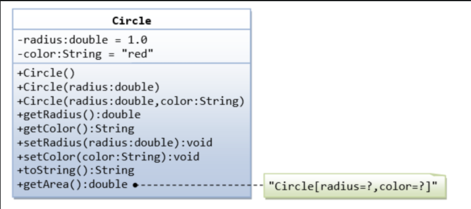

# Training Java - Week 1

## Classes & Objects:
- Do any of these and how many you want, while trying to respect these requirements from their UML tables in order the exercise and get accustomed to the language and some of it’s functionalities.
- Hint: you have getters/setters/constructor generators provided by IntelliJ ;)

